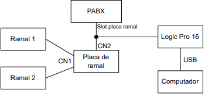

# Integração de ramais analógicos com FPGA utilizando processador softcore

Este repositório visa agrupar algumas informações referente ao projeto, Integração de ramais analógicos com FPGA utilizando processador softcore, que foi submetido à Coordenadoria do Curso de Engenharia de Telecomunicações do campus São José do Instituto Federal de Santa Catarina para a obtenção do diploma de Engenheiro de Telecomunicações.

- [Integração de ramais analógicos com FPGA utilizando processador softcore](#integração-de-ramais-analógicos-com-fpga-utilizando-processador-softcore)
  - [Objetivo do projeto](#objetivo-do-projeto)
  - [Setup do sistema](#setup-do-sistema)
  - [Execução do projeto](#execução-do-projeto)
    - [Executar o projeto no *kit* FPGA DE2-115](#executar-o-projeto-no-kit-fpga-de2-115)
    - [Executar a simulação do projeto](#executar-a-simulação-do-projeto)

## Objetivo do projeto

O objetivo do projeto foi integrar uma placa de ramal da central telefônica
Impacta 16, modelo 4990083, com um *kit* de desenvolvimento FPGA, modelo DE2-115,
para criar uma plataforma mínima para experimentações envolvendo canais digitais de
áudio e processadores sintetizados (softcores). Todas as informações, metodologias, testes e conclusões alcançadas, podem ser encontradas na monografia disponível na wiki do Instituto Federal de Santa Catarina, [aqui](https://wiki.sj.ifsc.edu.br/images/0/04/TCC_64_RENAN_RODOLFO_DA_SILVA.pdf).
## Setup do sistema

O setup do sistema utilizado para fazer as capturas, com o software Logic Pro 16, contidas na [monografria](https://wiki.sj.ifsc.edu.br/images/0/04/TCC_64_RENAN_RODOLFO_DA_SILVA.pdf) é apresentado na imagem abaixo.



## Execução do projeto

### Executar o projeto no *kit* FPGA DE2-115

O *branch* `DE2-115` possui um arquivo chamado `tcc.qar`, o qual pode ser utilizado para abrir o projeto no software Quartus Prime (foi utilizado a versão standard 20.1). No repositório também existe o diretório `tcc_restored/software/hotline` que possui as implementações em C++ criadas para fazer o controle da placa de ramal por meio do processador softcore Nios II. Para ser possível testar as facilidades implementadas, é necessário possuir o cenário apresentado na seção [Setup do sistema](#setup-do-sistema). Os seguintes passos descrevem as etapas necessáras para gravar o projeto no *kit*.

1. Fazer o clone deste repositório e alterar para a *branch* `de2-115` da seguinte maneira:

```
git clone https://github.com/renaner123/TCC.git
cd TCC/
git checkout de2-115
```
> Caso não tenha o git instalado, é possível fazer o download do repositório em `Code -> Download Zip`
> 
2. Abrir o projeto contido no arquivo `tcc.qar` no Quartus Prime em `File -> Open Project`
3. Fazer a compilação completa do projeto (*Compile Design*)
4. Fazer a gravação do VHDL no *kit* em `Tools -> Programmer`

### Executar a simulação do projeto

No *branch* `projeto`, existe dois arquivos de *testbench* que podem ser simulados através da ferramenta ModelSim, integrada ao Quartus, para fazer a análise do comportamento dos blocos utilizados na implementação do projeto. Para isso, os seguintes passos devem ser executados:

1. Fazer o clone deste repositório e alterar para a *branch* `projeto` da seguinte maneira:
 
```
git clone https://github.com/renaner123/TCC.git
cd TCC/
git checkout projeto
```
> Caso não tenha o git instalado, é possível fazer o download do repositório em `Code -> Download Zip`

2. Abrir o projeto contido no arquivo `tcc.qar` no Quartus Prime em `File -> Open Project`
3. Alterar o caminho `/path/TCC/tcc_restored` contido no *Destination folder* , deixando a pasta raíz do projeto `/path/TCC/`
4. Fazer a compilação completa do projeto (*Compile Design*)
5. Abrir o ModelSim em `Tools -> Run Simulation Tool -> RTL Simulation`
6. Executar o teste bench contido no arquivo `wave.do` usando o comando `do wave.do` na janela *Transcript*.

Na simulação do arquivo `wave.do`, o sinal `DXA_wire` está representado a entrada `DXA` e a porta `TDM0` está represetando a saída `DRA` da placa ramal.

> Também é possível executar o teste bench contido no arquivo `wave_debug.do`, o qual possui todos os sinais utilizados para chegar no resultado apresentado no `wave.do`.