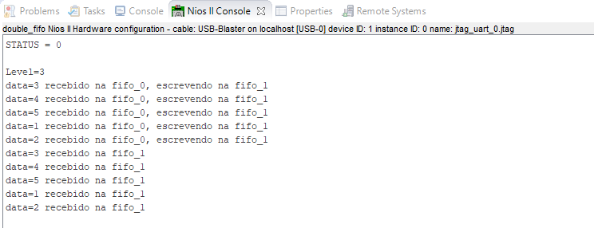
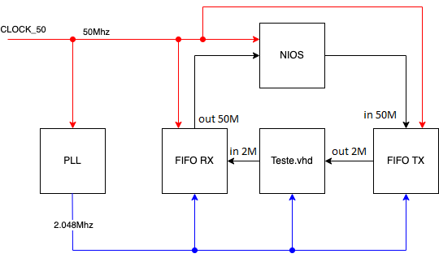
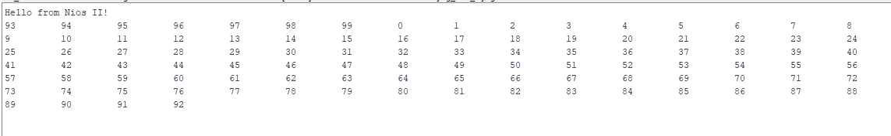

# Integração de ramais analógicos com FPGA utilizando processador softcore

Este *branch* possui alguns testes realizados para avaliar e entender o funcionamento de escrita e leitura das FIFOs quando controladas pelo Nios e quando controladas pela FPGA.

Sumário de testes:
- [FIFOs on Nios](#fifos-on-nios)
- [FIFOs on chip](#fifos-on-chip)
## FIFOs on Nios

Para este teste, foram adicionados dois blocos IP FIFO, para serem controladas pelo Nios, através do *Platform Designer*, uma para FIFO de recepção e um para FIFO de transmissão, além dos blocos de memória, Nios, etc. As FIFOs são controlados por um PIO chamado TX_EN, no qual habilita e desabilita a escrita nas FIFOs. 

O arquivo utilizado para testar o comportamento, feito em `C`, e o arquivo `.qar` do projeto se encontram neste diretório [aqui](tests/FIFO/duas_fifo_nios/).

Resultado da simulação no Eclipse

 

  

## FIFOs on chip

 Esse outro teste, foi realizado para avaliar o cenário de escrita e leitura das FIFOs pelo NIOS utilizando FIFOs on chip (controladas pela FPGA) conforme apresentado no diagrama de blocos abaixo.

 

Nesse teste, o Nios estava escrevendo um dado na entrada da FIFO_TX, que,estava sendo repassado pela FPGA para a entrada da FIFO_RX, e lido posteriormente pelo Nios.

O arquivo utilizado para testar o comportamento, feito em `C`, o arquivo `.qar` do projeto e o RTL do projeto se encontram neste diretório [aqui](tests/FIFO/fifo_tx_fifo_rx/).

Resultado da simulação no Eclipse

 

  

> Foram realizados outros testes com base nos dois exemplos estudados e que estão disponíveis na pasta [tests](tests/FIFO/). Qualquer dúvida sobre eles, fico a disposição.